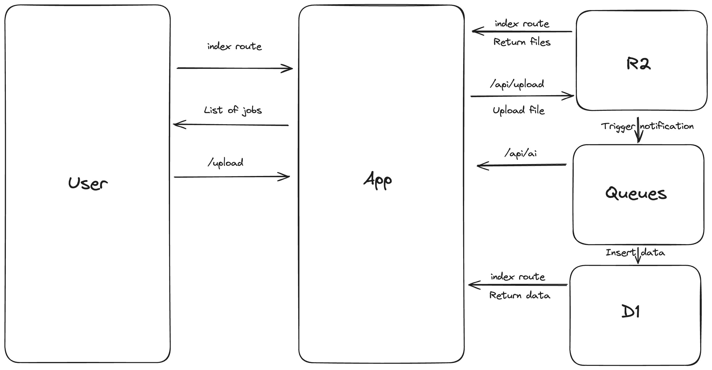

# Jobs At Conf

[Jobs At Conf](https://hirejuniors.dev/jobsatconf) is a job lisiting website for jobs one comes across at in-person conferences.

This monorepo consists the simple version of the web app and the workers for the Jobs At Conf project.

## Demo

Check out the demo video:

https://youtu.be/vjitMnmKKqA?si=eypGFyCtJUb-6_x8

## Built With

- [Next.js](https://nextjs.org/)
- [Cloudflare R2](https://developers.cloudflare.com/r2/)
- [Cloudflare D1](https://developers.cloudflare.com/d1/)
- [Cloudflare Queues](https://developers.cloudflare.com/queues/)
- [Workers AI](https://developers.cloudflare.com/workers-ai/)
- [Cloudflare Pages](https://developers.cloudflare.com/pages/)

## How does it work?

1. User uploads an image of a job poster
2. Once the image gets uploaded to an R2 bucket, an event notification is sent to a queue.
3. The queue consumer worker calls the `api/ai` endpoint.
4. This endpoint uses an AI model to extract information from the image, and store it in a D1 table.



## Getting Started

### Prerequisites

- A [Cloudflare account](https://dash.cloudflare.com/sign-up/workers-and-pages) with access to [R2](https://developers.cloudflare.com/r2/).
- Install [Node.js](https://nodejs.org/en/) and [npm](https://docs.npmjs.com/getting-started).

### Clone the repo

Run the following command to clone the project

```sh
$ git clone https://github.com/harshil1712/jobs-at-conf-demo.git
```

### Install dependencies

Execute the following command to install the dependencies

```sh
$ npm i
```

### Start local development server

Start the local development servers with the following command

```sh
$ npm run dev
```

## Learn more

Check out the directoris of the [web app](./apps/web) and the [worker](./apps/worker) for more details.
